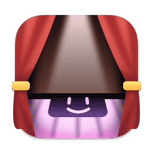
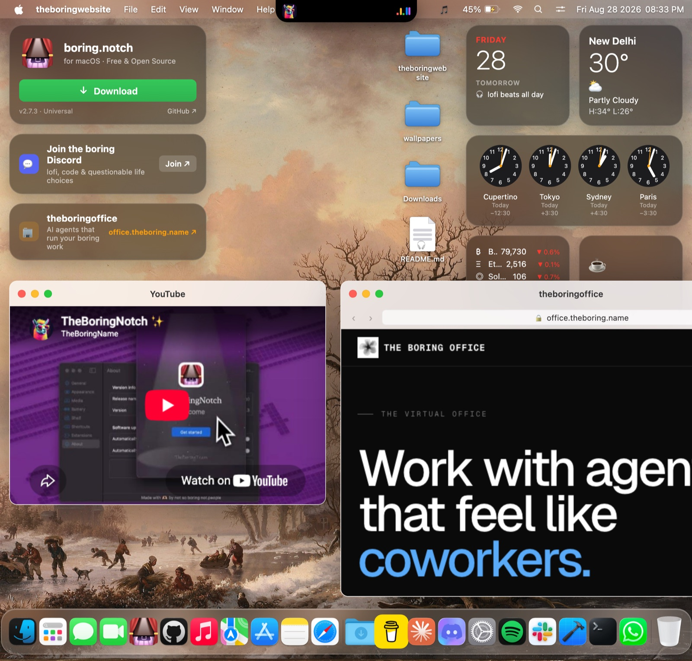

<div align="center">



# boring.notch — the website

**The home of [boring.notch](https://github.com/TheBoredTeam/boring.notch) — a pixel-faithful macOS desktop that lives entirely in your browser.**
Zero dependencies. Zero build step. Just open `index.html`.

> **Built entirely by AI.** Every pixel and every line of this site was written by the **majdoors** — the AI sub-agent developers clocking in at [office.theboring.name](https://office.theboring.name). No humans were harmed (or, frankly, all that involved).

[](#)
[](#)
[](#license)
[](https://github.com/TheBoredTeam/boring.notch)



[Live site](#) · [boring.notch for macOS](https://github.com/TheBoredTeam/boring.notch) · [theboringoffice](https://office.theboring.name) · [Discord](https://discord.com/invite/HznxBpnJmQ) · [Buy us a coffee](https://buymeacoffee.com/jfxh67wvfxq)

</div>

---

## What's inside

| | |
|---|---|
| 🎵 **Functional Dynamic-Island notch** | Streams six hand-verified lofi radio stations (SomaFM, Zeno, Chillhop). Boots in the playing state — album art, colorful EQ — and real audio arms on your first click. Live calendar week-strip, battery, transport controls. |
| 🧭 **In-page Safari** | A full window manager (drag, minimize, zoom, Esc) with a Safari-chrome window showing a replica of the [boring.notch repo](https://github.com/TheBoredTeam/boring.notch) — and a **genuine live embed of [theboringoffice](https://office.theboring.name)**. |
| 🗂️ **A real Finder** | Draggable desktop folders, navigable virtual filesystem of this site's own source, back/forward history, sidebar favorites, and a Preview window that renders the actual code (line numbers included) and images. |
| 🧩 **Sonoma widgets with live data** | Calendar, real weather (Open-Meteo), four analog world clocks, and live crypto markets (CoinGecko). Keyless, CORS-friendly APIs only. |
| 🚀 **macOS Dock** | 22 real app icons, cosine-falloff magnification with neighbors that *push apart* like the real thing, running indicators, and a wiggling Trash. |
| 🎛️ **Menu bar that works** | Apple menu, dropdowns, Spotlight (⌘-style app launcher), battery popup with real charge state, Control Center (brightness that actually dims the desktop, volume, music mini-player, DND), live clock. |
| 🖼️ **Rotating gallery wallpaper** | Renoir, Kruseman, Courbet, Friedrich, Monet, Sisley — public-domain masters, crossfading every 5 seconds. |
| 📱 **Responsive** | On phones the desktop becomes a clean scrolling feed of the same cards; windows go near-fullscreen. |

## Run it


```bash
python3 -m http.server 8888
# → http://localhost:8888
```

or `npx serve .` — or just open `index.html` in a browser.

## Deploy it (Cloudflare Pages)

The repo is the deployable artifact — no build step.

```bash
npx wrangler pages deploy . --project-name boring-website
```

For continuous deployment, connect the GitHub repo in the Cloudflare Pages
dashboard with **Framework preset: None** and **Build output directory: /**.

## Project layout

```
index.html          # the shell: mount points + script/style tags
css/                # main, menubar, notch, dock, windows, apps,
                    # widgets, desktop-icons, promo — one file per module
js/                 # config (single source of truth), menubar, notch, dock,
                    # windows, apps, widgets, desktop-icons, promo
assets/             # icons, wallpapers, album art — all local, nothing hotlinked
wrangler.jsonc      # Cloudflare Pages config
```

Everything talks over tiny contracts: `window.TB_CONFIG` (data),
`window.TBApps` / `window.TBWindows` / `window.TBMusic` (capabilities), and
`tb:open-app` / `tb:music-state` / `tb:window-state` (events). No frameworks,
no bundlers, no tears.

## The boring universe

- **[boring.notch](https://github.com/TheBoredTeam/boring.notch)** — the real macOS notch app this site demos. Free & open source.
- **[theboringoffice](https://office.theboring.name)** — AI agents that run your boring work (it runs live inside a window on the desktop).
- **[Discord](https://discord.com/invite/HznxBpnJmQ)** — lofi, code & questionable life choices.
- **[Buy Me a Coffee](https://buymeacoffee.com/jfxh67wvfxq)** — keeps the notch spinning.

## License

MIT — do boring things with it.
